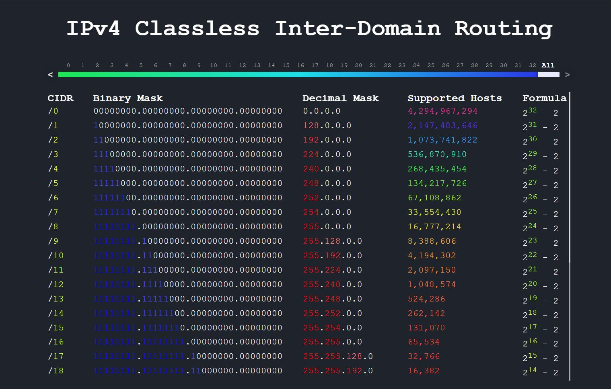

# CIDR tools
## Interactive IPv4 Classless Inter-Domain Routing Reference Chart

https://encap.github.io/cidr/

Made in Vue.js as a speedrun challenge during remote classes.
Later I added Electron.js to compile it into portable executable.

Build destination is set to docs for Github Pages hosting.

### Network IP address tool
network_ip_tool.html is built in pure javascript using mainly array functions calculates network IP address from client IP and mask

### Made by Łukasz Wielgus in 2020